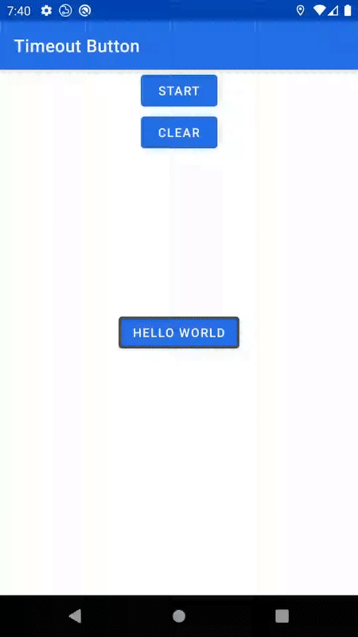

# Timeout Button

This repository contains the demo app and source code for the above.
The main class to pay attention to is `TimeoutWrapper` which expects a child of type `Button`.
It will draw over this child with a path that looks like a progress indicator and forms the timeout button effect as shown above.

`MaterialTimeoutWrapper` contains presets for properly wrapping a `MaterialButton`.

The following values can be adjusted for the progress indicator:
- color
- padding (top, left, bottom, right)
- radius
- animation duration
- stroke width

`TimeoutWrapper` exposes:
- `timeoutOccurred`: `PublishSubject<Unit>` to be notified when the timeout operation completes.
- `start()`: start the animation. If it is already running it will be restarted.
- `clear()`: clear the currently shown animation
